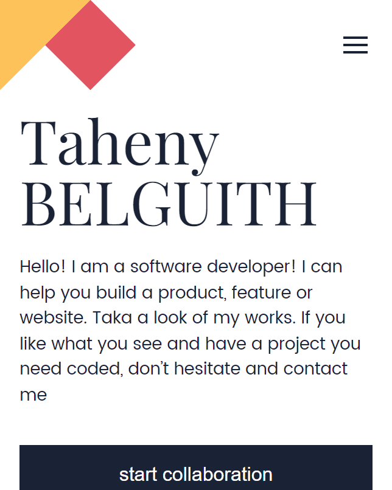
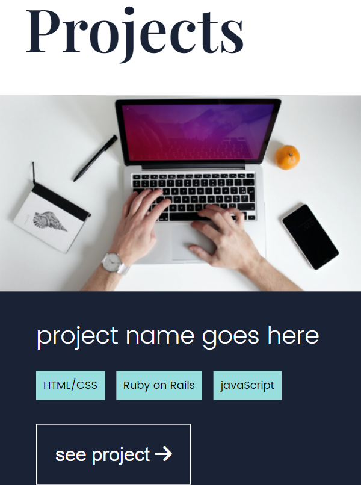

# My Portfolio

> This is my portfolio using Figma Template

  

  

## Built with

- HTML
- CSS

## Live demo

[My portfolio](https://tahenybelguith.github.io/my-identity/)

## Getting Started

> To get a local copy up and running follow these simple example steps.

### Prerequisites

- Github Account
- IDE
- Git

### Setup

- git init
- git clone git@github.com:TahenyBELGUITH/myPortfolio.git

## Authors

### 👩 Taheny BELGUITH

- GitHub: @TahenyBELGUITH
- Twitter: @BelguithTaheny
- LinkedIn: belguith taheny

## 👩 Collaborator:
- GitHub: [@githubhandle](https://github.com/edubew)
- Twitter: [@twitterhandle](https://twitter.com/@edube_winne)
- LinkedIn: [LinkedIn](https://linkedin.com/in/winfred-edube-9820a422a/)

### 🤝 Contributing

Contributions, issues, and feature requests are welcome!

> Feel free to check the issues page.

### Show your support

Give a ⭐️ if you like this project!

### 📝 License

This project is MIT licensed.
